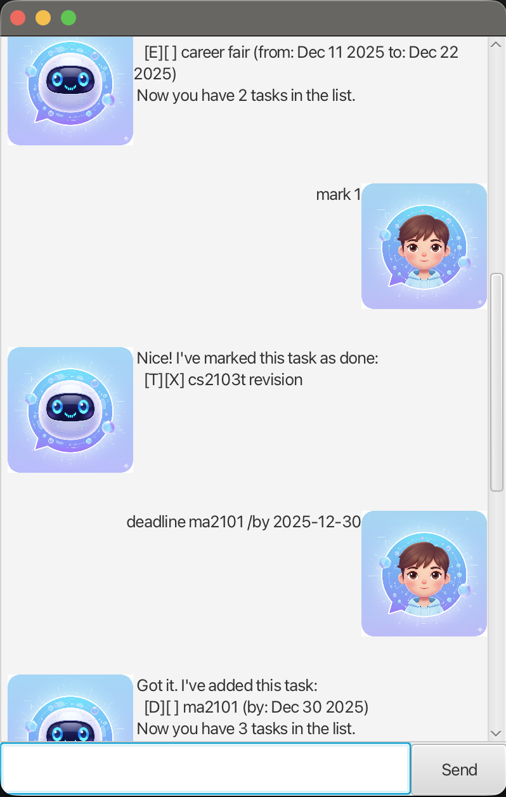

# Aeolian User Guide

Aeolian is a desktop chatbot app for managing tasks.  
It supports 3 types of tasks: todos, deadlines, and events, and the task data saved to disk for future sessions.



## Quick Start

1. Download the app JAR file (for example, `aeolian.jar`).
2. Open a terminal in the same folder as the JAR.
3. Run:

```bash
java -jar aeolian.jar
```

## How Commands Work

- Enter one command per message in the app input box.
- Task indexes are **1-based** (for example, `mark 1` marks the first task).
- Dates must use `yyyy-MM-dd` (for example, `2026-02-01`).
- Commands are lowercase (`list`, `todo`, `deadline`, ...).

## Features

### Viewing all tasks

Use `list` to show all tasks in your list.

Example: `list`

Expected output:

```text
Here are the tasks in your list:
1.[T][ ] read book
2.[D][X] return book (by: Mar 01 2026)
```

### Adding a todo

Use `todo <description>` to add a todo task.

Example: `todo read book`

Expected output:

```text
Got it. I've added this task:
[T][ ] read book
Now you have 1 tasks in the list.
```

### Adding a deadline

Use `deadline <description> /by <yyyy-MM-dd>` to add a task with a deadline.

Example: `deadline return book /by 2026-03-01`

Expected output:

```text
Got it. I've added this task:
[D][ ] return book (by: Mar 01 2026)
Now you have 2 tasks in the list.
```

### Adding an event

Use `event <description> /from <yyyy-MM-dd> /to <yyyy-MM-dd>` to add an event with start and end dates.

Example: `event project meeting /from 2026-03-10 /to 2026-03-11`

Expected output:

```text
Got it. I've added this task:
[E][ ] project meeting (from: Mar 10 2026 to: Mar 11 2026)
Now you have 3 tasks in the list.
```

### Marking a task as done

Use `mark <index>` to mark a task as completed.

Example: `mark 1`

Expected output:

```text
Nice! I've marked this task as done:
[T][X] read book
```

### Marking a task as not done

Use `unmark <index>` to mark a task as not completed.

Example: `unmark 1`

Expected output:

```text
OK, I've marked this task as not done yet:
[T][ ] read book
```

### Deleting a task

Use `delete <index>` to remove a task.

Example: `delete 2`

Expected output:

```text
Noted. I've removed this task:
[D][ ] return book (by: Mar 01 2026)
Now you have 2 tasks in the list.
```

### Finding tasks

Use `find <keyword>` to show tasks whose descriptions contain the keyword.

Example: `find book`

Expected output:

```text
Here are the matching tasks in your list:
1.[T][ ] read book
2.[D][ ] return book (by: Mar 01 2026)
```

Notes:
- Matching is case-sensitive (`find Book` is different from `find book`).
- If no tasks match, only the header is shown.

### Help

Use `help` to show the command summary.

### Exit

Use `bye` to save tasks and close the app.

Example: `bye`

Expected output:

```text
Bye. Hope to see you again soon!
```

## Data Storage

- Tasks are stored in `./data/aeolian.txt`.
- Data is written to the text file when you run `bye`.
- If the file or parent folder does not exist, the app creates it.

## Command Summary

- `list`
- `todo <description>`
- `deadline <description> /by <yyyy-MM-dd>`
- `event <description> /from <yyyy-MM-dd> /to <yyyy-MM-dd>`
- `mark <index>`
- `unmark <index>`
- `delete <index>`
- `find <keyword>`
- `help`
- `bye`
